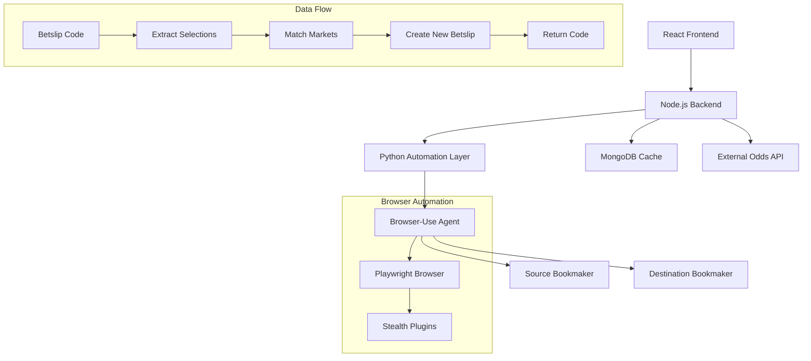

# Design Document

## Overview

The Betslip Conversion Website is a full-stack web application that automates the process of converting betslips between different bookmakers using browser automation. The system consists of a React frontend, Node.js backend, and Python automation layer powered by the browser-use library. The architecture prioritizes speed, reliability, and user experience while handling the complexities of web scraping and cross-platform betting market mapping.

## Architecture

### System Architecture Diagram



### Technology Stack

**Frontend:**
- React 18 with functional components and hooks
- Tailwind CSS for responsive styling
- Axios for HTTP client communication
- CDN-based deployment for simplicity

**Backend:**
- Node.js with Express framework
- CORS middleware for cross-origin requests
- Child process management for Python script execution
- RESTful API design

**Automation Layer:**
- Python 3.11+ with browser-use library
- Playwright as the underlying browser automation engine
- OpenAI GPT-4 for intelligent DOM parsing and task execution
- Stealth plugins for anti-bot protection bypass

**Data Storage:**
- MongoDB for caching game mappings and odds data
- In-memory caching for frequently accessed bookmaker configurations
- Optional Redis for session management

**External Services:**
- The Odds API for supplementary odds data
- Browser-use cloud service for enhanced reliability

## Components and Interfaces

### Frontend Components

#### BetslipConverter Component
```javascript
const BetslipConverter = () => {
  // State management for form inputs and results
  // Handles user interactions and API communication
  // Displays conversion results and error messages
}
```

**Props:** None (root component)
**State:**
- `betslipCode`: string
- `sourceBookmaker`: string  
- `destinationBookmaker`: string
- `result`: object | null
- `loading`: boolean
- `error`: string | null

#### BookmakerSelector Component
```javascript
const BookmakerSelector = ({ value, onChange, bookmakers, label }) => {
  // Dropdown component for bookmaker selection
}
```

#### ResultsDisplay Component
```javascript
const ResultsDisplay = ({ result, onNewConversion }) => {
  // Displays conversion results with comparison table
  // Shows warnings for partial conversions
  // Provides copy functionality for new betslip code
}
```

### Backend API Endpoints

#### POST /api/convert
**Request Body:**
```json
{
  "betslipCode": "string",
  "sourceBookmaker": "string", 
  "destinationBookmaker": "string"
}
```

**Response:**
```json
{
  "success": boolean,
  "betslipCode": "string",
  "selections": [
    {
      "game": "string",
      "market": "string", 
      "odds": number,
      "originalOdds": number,
      "status": "converted" | "partial" | "unavailable"
    }
  ],
  "warnings": ["string"],
  "processingTime": number
}
```

#### GET /api/bookmakers
**Response:**
```json
{
  "bookmakers": [
    {
      "id": "string",
      "name": "string",
      "baseUrl": "string",
      "supported": boolean
    }
  ]
}
```

### Automation Layer Architecture

#### BrowserUseManager Class
```python
class BrowserUseManager:
    def __init__(self, openai_api_key: str):
        self.llm = ChatOpenAI(model="gpt-4o", api_key=openai_api_key)
    
    async def extract_betslip_selections(self, betslip_code: str, bookmaker: str) -> List[Selection]
    async def create_betslip(self, selections: List[Selection], bookmaker: str) -> str
    async def verify_market_availability(self, selection: Selection, bookmaker: str) -> bool
```

#### BookmakerAdapter Interface
```python
class BookmakerAdapter:
    def get_betslip_url(self, betslip_code: str) -> str
    def get_betting_url(self) -> str
    def normalize_game_name(self, game_name: str) -> str
    def map_market_name(self, market: str) -> str
    def get_dom_selectors(self) -> Dict[str, str]
```

## Data Models

### Selection Model
```python
@dataclass
class Selection:
    game_id: str
    home_team: str
    away_team: str
    market: str
    odds: float
    event_date: datetime
    league: str
    original_text: str
```

### ConversionResult Model
```python
@dataclass
class ConversionResult:
    success: bool
    new_betslip_code: str
    converted_selections: List[Selection]
    warnings: List[str]
    processing_time: float
    partial_conversion: bool
```

### BookmakerConfig Model
```python
@dataclass
class BookmakerConfig:
    id: str
    name: str
    base_url: str
    betslip_url_pattern: str
    betting_url: str
    dom_selectors: Dict[str, str]
    market_mappings: Dict[str, str]
    team_name_normalizations: Dict[str, str]
```

## Error Handling

### Error Categories

1. **User Input Errors**
   - Invalid betslip codes
   - Unsupported bookmaker combinations
   - Malformed requests

2. **Automation Errors**
   - Browser automation failures
   - Anti-bot detection
   - Network timeouts
   - DOM parsing errors

3. **Business Logic Errors**
   - Unavailable markets
   - Expired events
   - Odds variations beyond tolerance

4. **System Errors**
   - Database connection failures
   - External API errors
   - Resource exhaustion

### Error Handling Strategy

```python
class ErrorHandler:
    @staticmethod
    async def handle_automation_error(error: Exception, context: str) -> ErrorResponse:
        if isinstance(error, TimeoutError):
            return ErrorResponse("TIMEOUT", "Request timed out", retry=True)
        elif isinstance(error, AntiBot Detection):
            return ErrorResponse("BLOCKED", "Access temporarily blocked", retry=True)
        # Additional error type handling
    
    @staticmethod
    def should_retry(error_type: str, attempt_count: int) -> bool:
        retry_policies = {
            "TIMEOUT": 3,
            "BLOCKED": 2,
            "NETWORK": 3
        }
        return attempt_count < retry_policies.get(error_type, 1)
```

### Retry Logic
- Exponential backoff for network errors
- Maximum 3 retry attempts per operation
- Circuit breaker pattern for consistently failing bookmakers
- Graceful degradation with partial results

## Testing Strategy

### Unit Testing

**Frontend Tests (Jest + React Testing Library):**
- Component rendering and user interactions
- Form validation and submission
- Error state handling
- Results display formatting

**Backend Tests (Jest + Supertest):**
- API endpoint functionality
- Request validation
- Error response formatting
- Python script integration

**Automation Tests (pytest):**
- Browser-use agent task execution
- DOM selector reliability
- Market mapping accuracy
- Error handling scenarios

### Integration Testing

**End-to-End Conversion Tests:**
```python
async def test_bet9ja_to_sportybet_conversion():
    # Test complete conversion flow
    result = await convert_betslip("TEST123", "bet9ja", "sportybet")
    assert result.success
    assert result.new_betslip_code
    assert len(result.converted_selections) > 0
```

**Cross-Browser Testing:**
- Chrome, Firefox, Safari compatibility
- Mobile browser support
- Different screen resolutions

**Bookmaker-Specific Tests:**
- Individual bookmaker scraping reliability
- Anti-bot measure handling
- Market availability verification

### Performance Testing

**Load Testing:**
- Concurrent conversion requests
- Browser automation resource usage
- Database query performance
- API response times

**Stress Testing:**
- High-volume betslip processing
- Memory usage under load
- Browser instance management
- Error recovery under stress

### Security Testing

**Input Validation:**
- SQL injection prevention
- XSS protection
- CSRF token validation
- Rate limiting effectiveness

**Data Protection:**
- Sensitive data handling
- Session security
- API key protection
- User privacy compliance

## Browser-Use Implementation Details

### Agent Configuration

```python
async def create_extraction_agent(betslip_code: str, bookmaker: str) -> Agent:
    task = f"""
    Navigate to {bookmaker_configs[bookmaker].base_url}, 
    locate the betslip input field, 
    enter the code '{betslip_code}', 
    submit the form, 
    and extract all betting selections including:
    - Game/match names
    - Betting markets (e.g., Match Result, Over/Under)
    - Odds for each selection
    - Event dates and times
    
    Return the data in structured JSON format.
    """
    
    return Agent(
        task=task,
        llm=ChatOpenAI(model="gpt-4o", api_key=os.getenv("OPENAI_API_KEY")),
        browser_config={
            "headless": True,
            "stealth": True,
            "timeout": 30000
        }
    )
```

### Anti-Bot Protection Strategy

1. **Stealth Mode Configuration:**
   - User agent rotation
   - Viewport randomization
   - Navigation timing simulation
   - WebRTC leak prevention

2. **Cloud Service Integration:**
   - Use browser-use cloud service for enhanced reliability
   - Automatic IP rotation
   - CAPTCHA solving capabilities
   - Regional access optimization

3. **Fallback Mechanisms:**
   - Multiple browser instances
   - Proxy rotation
   - Request queuing and delays
   - Alternative scraping approaches

### Market Mapping Intelligence

```python
class MarketMapper:
    def __init__(self):
        self.mappings = {
            "bet9ja": {
                "1X2": "Match Result",
                "Over/Under 2.5": "Total Goals Over/Under 2.5",
                "Both Teams to Score": "Both Teams To Score"
            },
            "sportybet": {
                "Match Result": "1X2", 
                "Total Goals Over/Under 2.5": "Over/Under 2.5",
                "Both Teams To Score": "Both Teams to Score"
            }
        }
    
    def map_market(self, market: str, from_bookmaker: str, to_bookmaker: str) -> str:
        # Intelligent market mapping with fuzzy matching
        normalized_market = self.normalize_market_name(market)
        return self.mappings.get(to_bookmaker, {}).get(normalized_market, market)
```

## Performance Optimizations

### Caching Strategy
- Game mapping cache (24-hour TTL)
- Bookmaker configuration cache (1-week TTL)
- Odds comparison cache (5-minute TTL)
- Failed conversion cache (1-hour TTL)

### Parallel Processing
- Concurrent browser instances for multiple selections
- Parallel market availability checks
- Asynchronous database operations
- Background cache warming

### Resource Management
- Browser instance pooling
- Memory usage monitoring
- Automatic cleanup of stale processes
- Connection pooling for database operations

This design provides a robust foundation for implementing the betslip conversion system with proper separation of concerns, comprehensive error handling, and scalable architecture patterns.